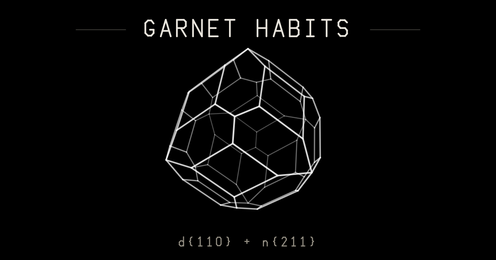

# Garnet habits

Continuous crystallographic form space of garnet, rendered as an interactive wireframe.

[](https://github.com/Doxastic-Defeater/garnet-habits/actions/workflows/test.yml)
[](LICENSE)

**Live demo → https://doxastic-defeater.github.io/garnet-habits/**

[](https://doxastic-defeater.github.io/garnet-habits/)

## What it is

Two sliders sweep a continuous two-parameter space of the real isometric garnet
forms: d{110} rhombic dodecahedron, n{211} trapezohedron and {321} hexoctahedron,
in every combination they can occur in. Every slider position is a true crystal
form computed from its Miller indices — the face planes are generated by signed
permutation of the index, pushed to their own distance from the centre, and clipped
against each other — not an artistic interpolation between shapes. What appears on
screen is whatever survived the clipping, and the habit label is a census of that
result rather than a prediction from the slider.

## The sliders

- **Habit** — `t` ∈ [0, 2], the path d{110} → d+n → n{211} → n+h → {321}.
- **{321} bevel** — `m` ∈ [0, 1], pulls hexoctahedral bevels onto whatever is there, giving d+h and d+n+h.
- **Variety** — recolours the wireframe (white, pyrope, almandine, spessartine, hessonite, demantoid, uvarovite). Display only; the colours are tuned for a black background, not measured.
- **Opacity** — master alpha on every edge, 5% to 100%.
- **Spin** — rotation rate, 0 to 3×.

The two shape sliders live in the URL as `?t=&m=&v=` (defaults omitted), so any
state is a permalink — **Copy link** grabs the current one. Seven **preset chips**
jump to the pure forms and combinations, and **Save PNG** exports the canvas at its
full 1120×1120 backing resolution.

## The seven habits

| Form | Miller | V / E / F |
|---|---|---|
| dodecahedron d | {110} | 14 / 24 / 12 |
| d + n | {110} + {211} | 62 / 96 / 36 |
| trapezohedron n | {211} | 26 / 48 / 24 |
| n + h | {211} + {321} | 74 / 144 / 72 |
| hexoctahedron | {321} | 26 / 72 / 48 |
| d + h | {110} + {321} | 62 / 120 / 60 |
| d + n + h | {110} + {211} + {321} | 110 / 192 / 84 |

## Run locally

No build, no dependencies. Open `index.html` in a browser, or serve the repo root:

```
npm start              # python -m http.server 8080
node tools/serve.js    # zero-dependency node static server, same port
```

On Windows shells where `node` is not on `PATH`, it lives at `C:\Program Files\nodejs`
— see [CLAUDE.md](CLAUDE.md) for the invocation.

```
npm test               # 13 checks, node >= 18
```

The suite checks V/E/F and χ, m-3m point-group symmetry, form purity at the
pure-form corners, the face census, the vertex shells, tangency-constant pinning at
k(1 ± 1e-4), seam and 2D continuity, `RangeError` domain semantics, a `vm` load
smoke test, golden-path fixtures against the pre-1.0 engine, nudge regressions and a
perf sanity bound.

## Using the engine

`src/engine.js` is pure geometry — no DOM, no dependencies — and loads both as a
classic script (setting `window.GarnetEngine`) and under `require`.

```js
const G = require('./src/engine.js');   // or <script src=".../src/engine.js">
const shape = G.shapeAt(0.5, 0.3);      // Map<"d3|n17", [[x,y,z],[x,y,z]]>
console.log(shape.size, G.formsPresent(shape));   // 192 { d: true, n: true, h: true }
for (const [key, [p1, p2]] of shape) { /* draw a line from p1 to p2 */ }
```

The file can be loaded straight from the Pages site at
`https://doxastic-defeater.github.io/garnet-habits/src/engine.js`. The full API —
`formAt`, `shapeAt`, `pathAB`, `formsPresent`, `makePlanes`, `clipShape` and the
transition constants — is documented in the
["Using the engine"](https://doxastic-defeater.github.io/garnet-habits/#engine)
section of the site.

## Design notes

[CLAUDE.md](CLAUDE.md) is the source of truth: architecture, the crystallography
invariants, the exact truncation radicals, the region-map closed forms, the nudge
factors and the Euler caveat. [REVIEW.md](REVIEW.md) has the independent review that
produced them — two read-only subagents, one on crystallography and one on code,
with every headline claim re-verified in the main session before it was recorded,
and a resolution table for what landed in v1.0.0.

Known gaps and ideas live in the [backlog in CLAUDE.md](CLAUDE.md#backlog).

## Regenerating assets

Both generators are deterministic and re-derive their content from the engine; CI
fails if the committed output is stale.

```
node tools/region-map.js    # assets/region-map.svg — the (a,b) region map
node tools/og-card.js       # assets/og.png — the 1200x630 social card
```

## Citation

If you use this, please cite:

```
Doxastic-Defeater. Garnet habits — continuous crystallographic form space (v1.1.0),
2026. https://github.com/Doxastic-Defeater/garnet-habits
```

## License

[MIT](LICENSE).
